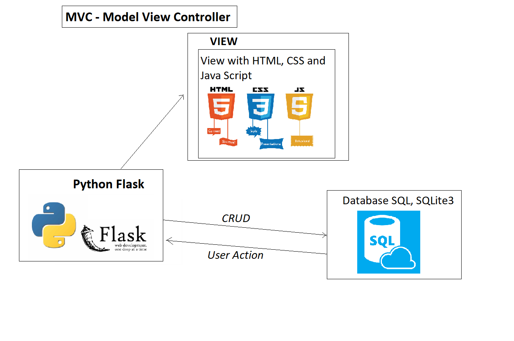

# This lesson covers mvc with flask in python

## MVC- Model View Controller

### Display data on the browser using HTML, CSS, JS and BOOTSTRAP
- HTML - Hyper Link Markup Language
- CSS - Cascading Style Sheet
- JS - Java Script
- BOOTSTRAP

**Building our API**
- Display data from python flask to specific API call/URL/ end point/

**Why Flask**
- Flask is a web app framework
- Very powerful to interact with DB and user interface/ browsers etc
- Flask can be used to create an API
- It allows us to integrate with HTML, CSS, JS
- It allows us to map HTTP requests to python
functions - URL - HTTP GET
- It allows us to set the API path as URL to view in the browser

- Let's install Flask
```
pip install flask
```
- Ensure flask is installed

- How to run the flask app (for me use `python -m flask run`)
```
flask run
```
**interacting with HTML**
- Naming conventions are essential
- we need create templates folder in our dir
- flask looks for templates folder and anything inside the folder
- we will create index.html inside our templates folder

**Task**
- create a base.html file in templates folder
- copy index.html to base.html
- google how to extend code from base.html to index.html
- Create text boxes for login form
- search and find out syntax to write a for loop in index.html

